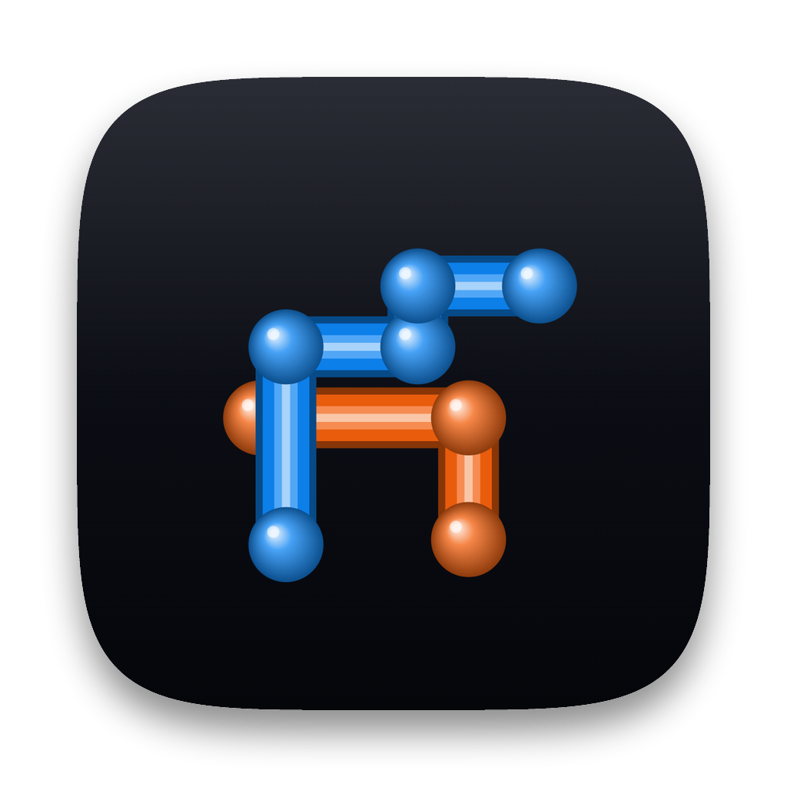

<div align="center">
  
  <h1>3D Pipes</h1>
  <p>The Windows 95/XP <em>3D Pipes</em> screensaver, rebuilt in the browser with WebGL.</p>
  <p><strong>▶ <a href="https://christianhpoe.github.io/pipes/" target="_blank" rel="noopener noreferrer">Live demo</a></strong></p>
</div>

Pipes grow cell-by-cell through a 3D grid, turning at right angles, sprouting glossy
ball joints at every bend, and filling the space with candy colors before wiping and
starting over. The Utah-teapot easter egg is in there too.

It's a single HTML file plus a vendored copy of [Three.js](https://threejs.org), so it
runs **fully offline** with no build step and no network.

## Run it

Because the page uses ES modules, most browsers won't load them straight off the
filesystem (`file://`). Serve the folder over HTTP instead:

```bash
python3 -m http.server 8000
# then open http://localhost:8000/index.html
```

Any static file server works. To open it directly from `file://`, launch Chrome with
`--allow-file-access-from-files` (see the macOS app note below).

## Controls

| Action | What it does |
| --- | --- |
| **Drag** | Look around (camera stays put inside the volume) |
| **Scroll** | Zoom the lens in / out |
| **Space** or **R** | Wipe and restart |
| **F** | Toggle fullscreen |

## How it works

The world is an integer grid. Each pipe keeps a position and a direction and walks one
cell per tick, biased to go straight but turning at `TURN_PROB`. Occupied cells are
tracked in a set so pipes never cross themselves or each other; a dead end retires the
pipe and a new one is born elsewhere (staggered, so they don't all start together). Each
straight run is a reused cylinder geometry, each bend gets a sphere (or, rarely, a
teapot). When the grid passes `FILL_LIMIT`, it clears and restarts.

Colors advance by the golden angle each new pipe, so consecutive pipes are always far
apart in hue.

## Tweak it

All the knobs live at the top of the `<script>` in `index.html`:

| Constant | Meaning |
| --- | --- |
| `NX, NY, NZ` | Grid size (the room you sit inside) |
| `STEP_MS` | Growth speed — lower is faster |
| `N_PIPES` | Max pipes alive at once |
| `SPAWN_CHANCE` | How staggered the births are |
| `TURN_PROB` | How twisty the pipes are |
| `TEAPOT_PROB` | Chance a bend is a teapot |
| `FILL_LIMIT` | How full before it wipes and restarts |
| `KEEPOUT_R` | Clear bubble kept around the camera |

`_icon.html` is the generator for the app icon (`icon.png`); restyle and re-render if
you want a different look.

## Run it fullscreen on macOS

Run the installer. It builds `Pipes.app` into `~/Applications`, generates the icon from
`icon.png`, and registers it with Spotlight/Launchpad:

```bash
./install-macos.sh
```

Then launch **Pipes** from Spotlight (⌘-Space → "Pipes"), Launchpad, or drag it to your
Dock. It opens fullscreen — Chrome kiosk if Chrome is installed (loads the local files
offline), otherwise your default browser via a small local server. ⌘-Q quits.

Re-run the installer any time to rebuild. Uninstall with `rm -rf ~/Applications/Pipes.app`.

## Credits

- [Three.js](https://threejs.org) (MIT) — vendored in `vendor/`, including the Utah
  teapot geometry.
- Inspired by Microsoft's original *3D Pipes* (`sspipes.scr`).

## License

MIT — see [LICENSE](LICENSE).
